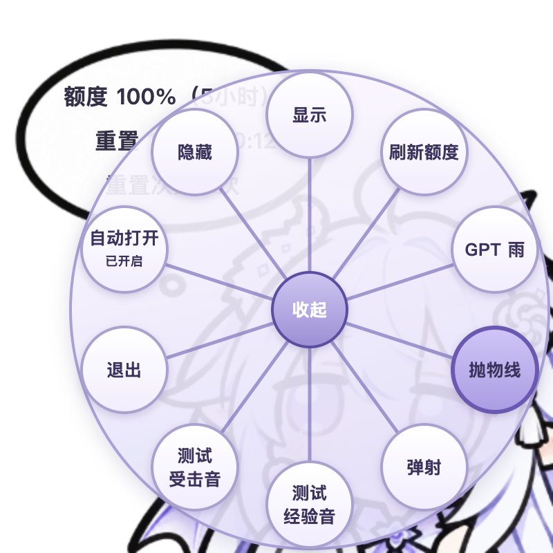

# GPT 娘 · Codex 额度桌宠

[English](README.en.md) · [下载 Windows 版](https://github.com/tlt-ops/codex-quota-pet/releases/latest) · [验证记录](docs/TESTING.md)

固定在屏幕右下角的桌宠，显示本机 Codex 已登录账号的剩余额度、重置时间和可用重置次数。Windows 版使用 Electron，仓库也保留原来的 macOS Swift 源码。



## Windows 下载与启动

在 [Releases](https://github.com/tlt-ops/codex-quota-pet/releases/latest) 选择：

| 文件 | 用法 |
| --- | --- |
| `*-setup.exe` | 每用户安装程序，推荐日常使用 |
| `*-portable.exe` | 单文件直接运行；启用自动打开后保持文件位置固定 |
| `*.zip` | 解压整个目录，再运行 `Codex Quota Pet.exe` |

支持 Windows 10 / 11 x64。桌宠本身已包含运行环境，直接使用发布包不需要安装 Node.js。

额度通过本机 Codex CLI 的只读 `account/rateLimits/read` 接口读取。应用会寻找 PATH 中和桌面应用随附的 CLI；没有找到时，请安装官方 CLI 并用 ChatGPT 账号登录：

```powershell
npm install -g @openai/codex
codex login
```

以上安装 CLI 的方式需要先安装 Node.js。已有可用 CLI 时不用重复安装。也可用环境变量 `CODEX_QUOTA_PET_CLI` 指定本机 CLI 路径。接口失败时显示“额度暂不可用”，不会猜测数字。接口说明见 [OpenAI App Server 文档](https://learn.chatgpt.com/docs/app-server)。

## 交互

- 气泡分三行显示额度、重置时间、重置次数，每分钟刷新。
- 按住人物时，以点击位置为中心向内形变；气泡与文字保持原样。按住越久，松开后小角色的速度与仰角越大。
- **恰好双击**人物后展开十项轮盘：显示、隐藏、刷新、GPT 雨、抛物线、弹射、两个音效测试、自动打开和退出。快速连点三次或更多时，每次点击发射小角色。右键人物也能打开轮盘。
- 抛物线小角色落出屏幕后移除。弹射小角色在边缘立即反弹，角度与减速有随机变化，反弹五次后继续移动并淡出。
- GPT 雨持续生成十秒，最多同时显示 300 个小角色；已经生成的小角色会继续落出屏幕。
- 同一额度窗口的剩余整数百分比每下降 1%，播放一次 Minecraft 受击音；重置到达、额度恢复或可用重置次数增加时播放经验音。启动与接口恢复后的首个结果仅建立基准，不补播历史变化。
- 两个音效测试按钮只试听，不改变额度或消耗重置次数。音频从 Mojang 官方资源服务器下载并校验，发布包不内置游戏音频。

## 随 Codex 自动打开

第一次运行发布版会设置当前用户的登录启动项。后台监视器等待 Codex / ChatGPT 桌面应用启动，再显示桌宠。可以在轮盘或系统托盘关闭“自动打开”。

“隐藏”和“退出”的选择会保存在 `%APPDATA%/CodexQuotaPet/visibility.json`。同一桌面进程的重新激活、监视器重启和虚拟桌面切换会保留该选择；确认更晚启动的新桌面主进程后才恢复自动显示。手动恢复请从托盘选择“显示”，或运行程序时加 `--show`。

设置、额度快照和音效缓存保存在 `%APPDATA%/CodexQuotaPet/`。程序通过 Codex 自身处理登录，不读取认证文件、聊天正文或浏览器页面。

## 开发与构建

Node.js 22 或更新版本：

```powershell
npm ci
npm test
npm start
npm run smoke
npm run dist:win
```

GitHub Actions 在 Windows runner 上运行测试、捕获实际 Electron 窗口截图、打包，并再次启动打包后的程序检查。安装包、便携程序、ZIP 和 SHA-256 校验文件会发布到 Releases。源码与打包程序的检查结果见 [TESTING.md](docs/TESTING.md)。

原来的 macOS 实现在 [native/macos](native/macos/)。在 macOS 上运行 `bash native/macos/scripts/package_app.sh` 可重新打包原生应用。

## 开源与素材

代码采用 [MIT 许可证](LICENSE)。角色图由用户提供，并已获得随公开仓库发布的授权；图片的具体授权范围和参考项目说明见 [ASSETS.md](ASSETS.md)。Minecraft 音频的来源与使用规则也在该文件中列出。

欢迎提交问题和改进，见 [CONTRIBUTING.md](CONTRIBUTING.md)。
